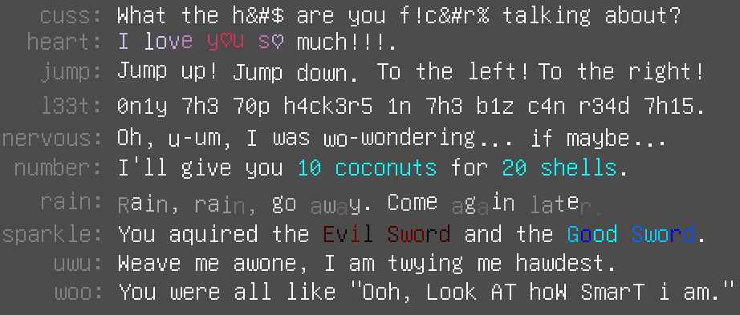
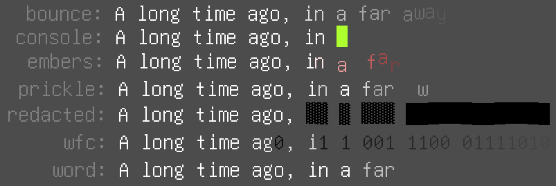

Effects Preview:

https://user-images.githubusercontent.com/18387401/130072369-90f99c72-358e-41fe-af4d-cfea32665741.mp4

Transition Preview:

https://user-images.githubusercontent.com/18387401/130072410-a80b2545-3a13-4704-af9b-000e3816de35.mp4

Released as is. You may need to figure things out yourself, but I included demos.

**addons/teeb.text_effects**: Simple bbcode elements to use in *RichTextLabel*s.

**addons/teeb.text_transitions**: Hacky text animations. A bit complex to implement.

***Many of these effects require a monowidth font to work properly.***

## Got ideas?

Make a feature request of any text effects you'd like to see, and I'll try to implement them.

## Effects

The effects be used like any other bbcode.

`
Hey... [nervous]muh-maybe could I...[/nervous] have the [sparkle c1=red c2=yellow c3=black][cuss]Hecking[/cuss] Cool Sword[/sparkle] of [sparkle c1=yellow c2=orange]maximum unrelenting power[/sparkle]?
`

**cuss**: Replaces letters with symbols, to censor the word, somewhat.

**heart**: Simple wave animation, where some letters are replaced by heart emoji.

- scale: Size of jumping.
- freq: The waviness.

**jump**: Demonstrates how to do animate at the word level, rather than just individual letters.

- angle: Angle to jump in. (Degrees.)

**l33t**: Replaces letters with numbers. Only use if you're a hacker.

**nervous**: Gives every word a unique jiggle.

- scale: The scale of jumpiness.
- freq: The speed of jumpiness.

**number**: Automatically colorizes numbers and the first word after the number.

- color: The color.

**rain**: Just a rainy effect. Not useful, but I think it looks nice.

**sparkle**: Can take up to 3 colors, which it will interpolate between for every letter.

- freq: The frequency. Greater = individual letters are more similarly colorized.
- c1: Color 1
- c2: Color 2
- c3: Color 3

**uwu**: Replaces all letters R and L with W.

**woo**: Alternates between upper and lowercase for all the letters, suggesting a condescending tone.

- scale: The scale of the waves.
- freq: The frequency of the waves.

## RichTextTransition Node

Warning: This is a hacky, wonky implementation of text transition effects. But it works well enough for me.

### Node Properties

**id**: Only necessary if you want to use multiple different *RichTextTransition*s at once.

**time**: The animation state. Slide this in editor to preview, or modify it with an *Animator* or *Tween* node.

**length**: The number of characters or words effected by the animation.
Shorter = quicker, pop-ier animations.
Longer = gradual, flow-ier animation.
For transitions like ***console*** this should be set to 1.

**reverse**: Should be set before transitioning out.

**all_at_once**: If you just want all characters to fade in/out at once, use this.

**animation_time**: Used by ***fade_in*** and ***fade_out*** methods.

0.5 = half normal speed.

2.0 = twice normal speed.

### Node Methods

**fade_in**: Calls the *AnimationPlayer* ***fade_in*** animation.

**fade_out**: Calls the *AnimationPlayer* ***fade_out*** animation.

### Transitions

The following can be used like any other bbcode.

`
[embers]Long ago, legends foretold...[/embers]
`

But if you are using multiple *RichTextTransition*s, best to include a unique id attribute that matches the *id* field in the node.

`
[embers id=unique_id]Long ago, legends foretold...[/embers]
`

**bounce**: Letters fade and bounce in.

**console**: Letters are lead in by a blinking "cursor." When fading out they scroll up.

**embers**: Letters fade in/out from random directions.

- scale: Distance to move in/out from.
- color: Color of the "embers."

**prickle**: Letters fade in/out in a noisy random way.

- pow: Power of fade in. Larger = more abrupt.

**redacted**: Letters are blocked out before being exposed.

- freq: Y offset frequency.
- scale: Y offset scale.

**wfc**: Wave function collapse inspired effect, where flickering numbers "collapse" to letters.

**word**: Fade in/out on a word by word basis, rather than letters.
